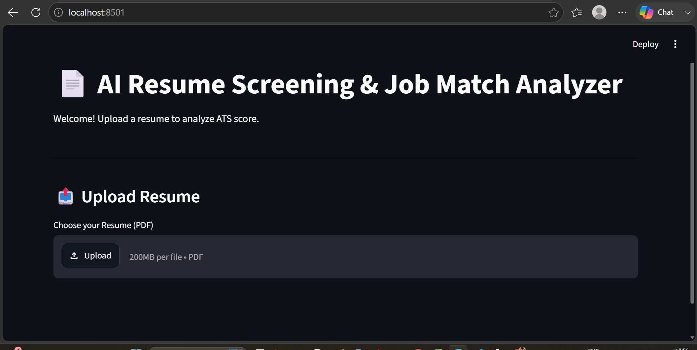
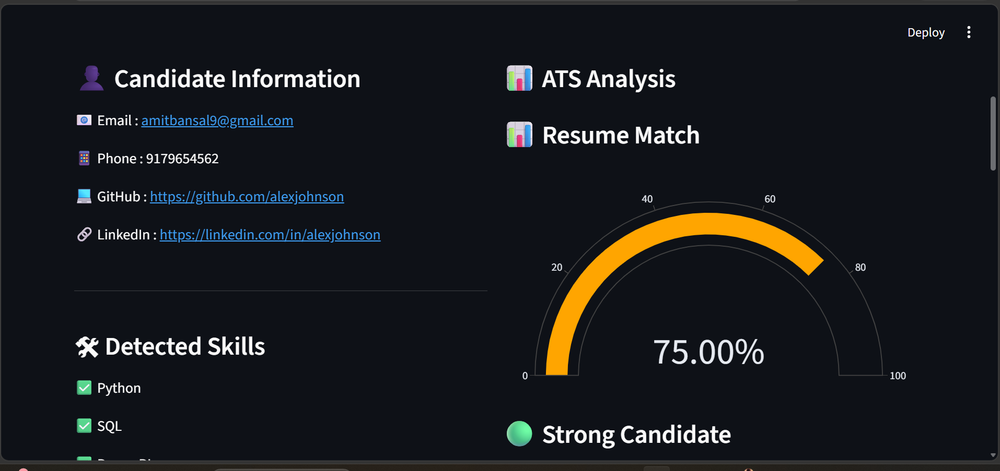
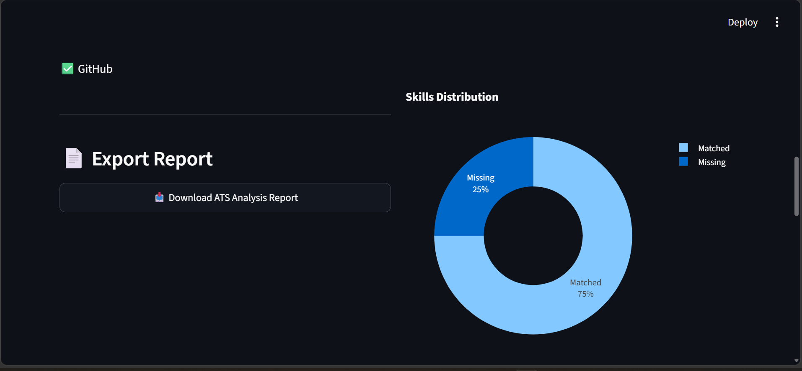

# 📄 AI Resume Screening & Job Match Analyzer

An AI-powered Resume Screening application built with Python and Streamlit.

This project analyzes resumes, compares them with a Job Description (JD), calculates an ATS Score, identifies matched and missing skills, provides resume improvement suggestions, and generates a downloadable PDF report.

---

## 🚀 Features

- Resume PDF Upload
- Resume Text Extraction
- Candidate Information Extraction
- ATS Score Calculation
- Job Description Matching
- Matched Skills Detection
- Missing Skills Detection
- Resume Improvement Suggestions
- ATS Score Gauge Chart
- Skills Distribution Pie Chart
- PDF Report Generation

---

## 🛠 Tech Stack

- Python
- Streamlit
- Plotly
- PyMuPDF (fitz)
- ReportLab

---

## 📂 Project Structure

```
AI Resume Screening & Job Match Analyzer
│
├── streamlit_app.py
├── parser.py
├── candidate_info.py
├── matcher.py
├── job_parser.py
├── report_generator.py
├── suggestions.py
├── skills.py
├── requirements.txt
└── job_description/
```

---

## 📊 Workflow

1. Upload Resume
2. Extract Resume Text
3. Read Job Description
4. Extract Skills
5. Compare Resume vs JD
6. Calculate ATS Score
7. Generate Suggestions
8. Export PDF Report

---

## 📸 Screenshots

### Home Page



### Dashboard



### Report



## ▶️ Run Project

```bash
pip install -r requirements.txt

streamlit run streamlit_app.py
```

---

## 👨‍💻 Author

**Shivam Pal**

GitHub:
https://github.com/ShivamPal91